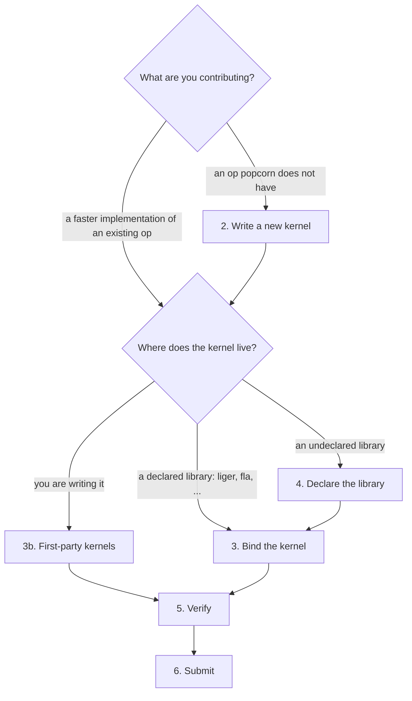

# Contributing

Answer the question at each step and follow the arrow. Registration is validated at import time and correctness is graded by the harness, so mistakes raise errors that say what to fix.

> [!INFO]
> By contributing you agree that your contributions are licensed under [Apache-2.0](LICENSE). Adapted code must credit its origin in the header comment and be license-compatible (MIT, BSD, Apache).



> [!NOTE]
> → First time here: [0. Setup](#0-setup)
>
> → A faster implementation for an op popcorn already has: [1. Support an existing kernel](#1-support-an-existing-kernel)
>
> → An op popcorn doesn't have yet: [2. Write a new kernel](#2-write-a-new-kernel)
>
> → A kernel you are writing yourself: [3b. First-party kernels](#3b-first-party-kernels)

## Definitions

**kernel (op)** — a pure unit of work with a fixed signature and semantics defined by a ground-truth PyTorch reference and optionally implemented by optimized backends.
**backend** — one implementation of an op: the torch reference, an external library binding, or a first-party kernel.
**case** — one point of an op's test grid: concrete dim sizes, batch shape, dtype, scalar arguments, and which optional tensors are present.

---
## 0. Setup

From the repository root:

```bash
uv sync
uv run pytest tests -q       # GPU smoke tests auto-skip without CUDA
scripts/format.sh            # ruff format + lint fixes
```

With the [Ruff extension](https://marketplace.visualstudio.com/items?itemName=charliermarsh.ruff), the checked-in `.vscode/settings.json` formats and lint-fixes on save; `scripts/format.sh` does the same from the terminal. There are no commit hooks — CI enforces formatting on the PR.

Backend extras (`fla`, `liger`, ...) are declared in [pyproject.toml](pyproject.toml); install the ones you work on with `uv sync --extra fla`. Verifying backends ([5. Verify](#5-verify)) needs a CUDA machine; everything else runs on CPU.

> [!NOTE]
> → Adding a backend to an existing op: [1. Support an existing kernel](#1-support-an-existing-kernel)
>
> → Adding an op: [2. Write a new kernel](#2-write-a-new-kernel)

---
## 1. Support an existing kernel

Ops live in `src/popcorn/kernels/<op>.py`, one file per op. Libraries are declared once, in `src/popcorn/kernels/__init__.py`; check its `declare_backend` lines for yours.

> [!NOTE]
> → Declared (`liger`, `fla`, ...): [3. Bind a kernel from a declared library](#3-bind-a-kernel-from-a-declared-library)
>
> → Not declared: [4. Declare a new library](#4-declare-a-new-library), then return to 3

## 2. Write a new kernel

Create `src/popcorn/kernels/<op>.py` with a pure-torch reference and decorate it:

```python
@register_kernel(
    test_args={"eps": [1e-6, 1e-5]},
    tags={Tag.NORMALIZATION},
)
def rms_norm(
    x: Float[Tensor, "... normalized_shape"],
    weight: Float[Tensor, "normalized_shape"],
    bias: Float[Tensor, "normalized_shape"] | None = None,
    eps: float = 1e-6,
) -> Float[Tensor, "... normalized_shape"]:
    r"""Root-mean-square normalization.

    $$y = \frac{x}{\sqrt{\overline{x^2} + \varepsilon}} \odot w + b$$

    [RMSNorm (Zhang & Sennrich, 2019)](https://arxiv.org/abs/1910.07467)
    """
    ...
```

`@register_kernel(fn, *, test_args=None, test_inputs=None, name=None, tags=None)`

- `test_args`: `{scalar: [values]}` to grid over; scalars without an entry derive their pool from a `Literal` annotation, `bool`, or the default
- `test_inputs`: `{tensor param: transform}` applied to the raw random draw when the op needs structured inputs (probabilities, log-space gates, normalized keys). A 1-arg transform gets the draw; a 3-arg transform gets `(draw, dims, generator)` for inputs built from the case dims, e.g. `cu_seqlens` offsets (see `src/popcorn/kernels/_varlen.py`)
- `name`: op name, defaults to the function name
- `tags`: a set of `Tag` members classifying the op; most kernels wear several

The reference is the contract: jaxtyping annotations on every tensor and return, plain or `Literal` annotations on scalars (default value first), every default declared here, differentiable, and half precision upcast for reductions. Single-tensor returns also get a `torch.ops.popcorn` binding. No branching on backends or devices. Differentiable is unconditional: never guard the reference with grad checks or raises — an implementation without a backward is a backend registered `forward_only=True` (see [3](#3-bind-a-kernel-from-a-declared-library)), and the reference is what autograd calls fall back to. Dim pools come from `popcorn/core/dims.py` (`DIMS`); `test_args` only grids scalars. Runtime shape validity comes from report rows / fitted regions, not per-op declarations.

### The docstring

Every reference docstring follows one format, enforced by `test_kernel_doc_format` and parsed into `op.summary` / `op.math` / `op.citations` — everything below the summary is plain markdown, rendered verbatim on the kernel's card:

- **Summary**: one line, ≤100 chars, ending in a period. Pure prose — no formulas, no citations.
- **Math**: after a blank line, exactly one `$$...$$` block defining what the op computes. Symbols mirror the parameter names (`weight` → `w`), the output is `y` (recurrent ops write the state recurrence and readout, `S_t`, `o_t`; losses write `\mathcal{L}`), `\odot` is elementwise product, `\varepsilon` is `eps`, `\overline{\cdot}` is a mean over the normalized dim. Use `r"""` so backslashes survive.
- **Citations** (optional): after a blank line, a comma-separated list of markdown links, wrapping after commas when long. Cite the work that defines the op first, then seminal algorithmic works central to why the kernel exists (`attn` cites FlashAttention). Labels are `Work (FirstAuthor et al., year)` for papers, the bare project name for repos; any https URL is fine. Code-level provenance stays with `source=` and the "Adapted from" comments in `impls/`.

### Tags

All tags live in `src/popcorn/core/tags.py` — read it before tagging, and add a new tag there and only there when none fits. That single file is what prevents near-duplicate tags; the tests reject untagged kernels and unworn tags in both directions.

> [!TIP]
> Op name: snake_case, the established torch/literature name (`rms_norm`, never `liger_rms`). Reference function: named exactly the op. Shapes: the canonical vocabulary in `src/popcorn/core/dims.py` (names and their default grid pools) — reuse before inventing, torch's names where torch has them (`normalized_shape`, `vocab`, `tokens`), no abbreviations; `...` for batch dims; `heads` for one head count, `q_heads`/`kv_heads` when query and kv counts differ. A size determined by another is an expression, never a name: `response+1`, `head_dim/2`, `seq*num_householder` (one operation, the operand an int or a scalar parameter) — the grid computes it and dispatch validates it. Scalars: torch's parameter names (`eps`, `ignore_index`); booleans default `False`. One op, one meaning: semantic switches are separate ops, not flags.

> [!NOTE]
> → Bind backends to the new op: [1. Support an existing kernel](#1-support-an-existing-kernel)
>
> → Reference-only op (backends can come later): [5. Verify](#5-verify)

## 3. Bind a kernel from a declared library

`@op.register(name, source=None, predicate=None, forward_only=False)`

- `name`: backend name
- `source`: dotted path to the external kernel, imported lazily on first dispatch; trailing segments may be attributes (`unsloth.kernels.layernorm.Fast_Layernorm.apply`), and a module path serves its members through `kernel` attributes (`kernel.matmul`); alone it must match the reference signature exactly
- `predicate`: `f(**args) -> bool` veto, last resort (poison-avoidance, not shape ranges)
- `forward_only`: `True` for kernels without a usable backward, including decode/inference-oriented implementations — a step-wise decode kernel that can serve the parent's signature registers on the op it computes (fla's `fused_recurrent_*` forms take full sequences, so they are `fla:recurrent` on the same op as `chunk_*`), never as a separate `*_decode` op. The one exception is a step kernel whose contract cannot fit the parent — no seq axis, explicit state in/out (`mesa_net_decode`) — which becomes its own op with the state in its signature. The dispatcher considers a forward-only backend only when no gradient can flow (grad disabled, or no input requires grad); otherwise the call falls through to the remaining backends and the torch reference. The harness grades them forward-only

Shape validity is learned from report rows (`python -m popcorn.bench map`), not declared. Dim probe pools live only in `DIMS` (`popcorn/core/dims.py`); the fitter turns pass/fail/oom labels into regions. Scalar kwargs are classified once in `popcorn/core/args.py` (`SPEED_ARGS` vs `NEUTRAL_ARGS`): discrete values exact-match in the validity stratum, floats fit as `Real` bands like dims, and only `SPEED_ARGS` participate in timing nearest-neighbor.

Dispatch admission and ranking live on `op.tuner.policy` (`popcorn.core.policy.Policy`). The default is safe (outside a fitted region → torch). `unsafe=True` on the call (or `POPCORN_UNSAFE=1`) extrapolates for backends that already have a proven range, then picks the nearest timed neighbor — replace or subclass `Policy` to change that.

Source matches the reference signature:

```python
swiglu.register("liger", source="liger_kernel.transformers.functional.liger_swiglu")
```

Source differs: attach an adapter. Exactly the reference parameters, same order, no defaults (the reference owns them); `kernel` is the resolved source. Adapter parameters stay unannotated — a narrowed annotation is not documentation here, it becomes a dispatch gate:

```python
@rms_norm.register("liger", source="liger_kernel.transformers.functional.liger_rms_norm")
def rms_norm_liger(x, weight, bias: Literal[None], eps):   # dispatched only when bias is None
    return kernel(x, weight, eps, in_place=False)
```

> [!TIP]
> Backend name: the library's short lowercase name (`liger`); `liger:chunked` only when one library ships several implementations of the op. Adapter: named `<op>_<backend>`, body is argument mapping only, and never an import — every library callable arrives through `source=`, which keeps it lazy and fingerprinted; any arithmetic means different semantics, which means a different op. Backends listed alphabetically in the file; benchmarks decide speed, not order. Value and dtype constraints are narrowed annotations; shape ranges are learned from the report table.

> [!NOTE]
> → Binding done: [5. Verify](#5-verify)
>
> → Writing the kernel yourself: [3b. First-party kernels](#3b-first-party-kernels)

## 3b. First-party kernels

A kernel you wrote yourself, with no external library. The implementation lives in `src/popcorn/impls/<op>_tl.py` (Triton) or `src/popcorn/impls/<op>_cu.py` (CUDA): the kernels, a `torch.autograd.Function`, and a callable named exactly `<op>` with the reference signature. Autograd is handled inside; without a backward, register with `forward_only=True`. Registration is source-only under the `popcorn` backend:

```python
rotary_embedding.register("popcorn", source="popcorn.impls.rotary_embedding_tl.rotary_embedding")
swiglu.register("popcorn", source="popcorn.impls.swiglu_cu.swiglu", predicate=cuda_toolkit)
```

- Triton (`<op>_tl.py`): kernels live in the module; shared device introspection (`sm_count`, `capability`, `device_type`) comes from `src/popcorn/impls/_triton.py`.
- CUDA (`<op>_cu.py`): sources live next to the module as `src/popcorn/impls/<op>.cu` and JIT-build on first use through `impls/_cuda.load(op)`, cached by torch per source change and torch/CUDA version; register with `predicate=cuda_toolkit` so machines without nvcc skip the backend cleanly.

The `popcorn` backend is declared once, on the compiler it is written in (`triton`, pinned to the tested range), so report rows are keyed by the compiler version and a compiler upgrade re-validates the kernels. Iterate with `compare(mine, reference, inputs)` before registering, then run the grid.

To inspect a kernel under Nsight Compute:

```bash
python -m popcorn.impls._profile swiglu hidden=4096 --batch 8,2048 --dtype bfloat16 --grad
```

It builds one case (`name=value` overrides a dim or scalar argument, `+name` enables an optional tensor, everything else defaults to the largest tested size), warms up so JIT builds and autotuning stay out of the capture, and re-runs itself under `ncu` with profiling scoped to the final call. `--set full` for the deep-dive sections, `--kernel <regex>` to filter launches, `--out report` to write an `.ncu-rep` for the GUI instead of printing to stdout. In your own scripts, wrap the region in `popcorn.impls._profile.annotate()` and run under `ncu --profile-from-start off`.

> [!TIP]
> One implementation per module, no dispatch heuristics inside the kernel; the tuner owns speed decisions. Launch plumbing (`torch.autograd.Function`, launchers, caches) stays private (`_`-prefixed); the module exports only `<op>`. Code derived from elsewhere credits its origin in a one-line header comment: `# Adapted from <origin> ((c) <authors>, <license>)`.

> [!NOTE]
> → Kernel written and registered: [5. Verify](#5-verify)

## 4. Declare a new library

In `src/popcorn/kernels/__init__.py`:

```python
declare_backend("liger", package="liger-kernel", min_version="0.6.0", max_version="0.7.0", extra="liger")
```

- `package`: PyPI distribution name; auto-dispatch skips missing or out-of-range backends, forcing one raises with the install hint or version error
- `min_version` / `max_version`: accepted range, checked on first dispatch
- `extra`: install extra named in error messages

Add the matching extra to [pyproject.toml](pyproject.toml) and install it:

```toml
[project.optional-dependencies]
liger = ["liger-kernel>=0.6.0,<=0.7.0"]
```

```bash
uv sync --extra liger
```

> [!TIP]
> Extra name == backend name. Pins in the extra == pins in `declare_backend` == the range you actually ran the grid with.

Add the project to the Acknowledgement list in [README.md](README.md).

> [!NOTE]
> → Library declared: back to [3. Bind a kernel from a declared library](#3-bind-a-kernel-from-a-declared-library)

## 5. Verify

```bash
uv run pytest tests -q
uv run python -m popcorn.bench run [ops...] [--backend NAME] [--device cuda] [--reps 10] [--limit N] [--shard I/K]
uv run python -m popcorn.bench submit [ops...] [--array 8] [--reps 10] [--limit N] [--qos NAME] [--time 2:00:00] [--dry-run]
uv run python -m popcorn.bench view [--user] [--out index.html]
```

`scripts/bench_hardware.py` wraps `run` for the common case: the full grid for every op on the current machine, then a README badge regen. `scripts/update_readme.py` regenerates the badges without running anything.

To compare an unregistered callable first:

```python
from popcorn.bench import compare

result = compare(mine, reference, {"x": x, "weight": weight})
```

`compare` consumes concrete named inputs, checks forward and backward against fp64 truth, then times both callables. It owns no registry or persistence.

`run` executes the op's full grid (shapes x args x dtypes x batch ranks x optional-tensor presence), forward and backward. Correctness is completed before timing; a timing failure is recorded separately and never overwrites a correctness pass. `--reps` controls seeded comparisons and timed repetitions; `--limit` takes one deterministic per-op sample shared by every backend; `--shard I/K` selects one contiguous slice. Rows atomically upsert into `src/popcorn/reports/<op>.jsonl` by exact case, gradient requirement, hardware, Torch version, and backend version. `run` and `merge` regenerate the README badges automatically.

`submit` runs that grid as a slurm array. `--array` caps the shard count, `--qos` and `--time` set scheduling (`--qos` is omitted from the script when unset), and `--dry-run` only writes the script. The dependent merge fails if any shard file is missing. `view` renders the database as a self-contained HTML report; `--user` folds in your local cache rows.

| status | meaning | action |
|---|---|---|
| pass | worst error across reps within tolerance | none |
| skip | backend declined the case (gates, package) | none, expected |
| fail | numeric divergence | fix the adapter mapping, or narrow gates |
| crash | the implementation raised during correctness | see the reason column |
| oom | out of memory (censored; caps the fitted region) | shrink pools or accept the cap |
| error | harness or worker failure, correctness unknown | fix the harness or rerun |

A successful row may also have `bench_error`; correctness remains valid, but the timing must be rerun. In the detail matrix printed by `scripts/update_readme.py`, ✔ means every tested case passes, ✔* means at least one passes while another is gated, failed, or unverified, and ✘ means no case passes.

`op.validate(*args, backend=None, **kwargs)` checks a real call without timing. `op.benchmark(*args, backend=None, **kwargs)` checks and times it. These APIs write `${POPCORN_CACHE_DIR:-${XDG_CACHE_HOME:-~/.cache}/popcorn}/v2/reports` and never modify checked-in reports or the README.

Automatic dispatch admits a backend only with an exact pass row or membership in a fitted validity region (derived from report rows). Otherwise the reference serves the call. `POPCORN_BENCH=1` lazily measures and records on first encounter. Map regions with `python -m popcorn.bench map --effort standard`.

> [!TIP]
> Commit `src/popcorn/reports/*.jsonl`; they are the bundled database that tunes dispatch on contributor hardware. Reports and the README badges are machine-written, never edit them by hand. User-local cache rows are not committed.

> [!NOTE]
> → Zero fail, zero crash, zero error, and zero benchmark error: [6. Submit](#6-submit)
>
> → Fails or crashes: fix in [3. Bind a kernel from a declared library](#3-bind-a-kernel-from-a-declared-library), rerun

## 6. Submit

- [ ] `uv run pytest tests -q` green, `scripts/format.sh` leaves no diff
- [ ] full grid run for every op you touched: zero fail, crash, error, or benchmark error
- [ ] `src/popcorn/reports/*.jsonl` rows for your hardware committed, README badges regenerated (`scripts/update_readme.py`)
- [ ] version pins in `declare_backend` and the pyproject extra match what you tested
- [ ] PR description: op + backend, hardware, and the matrix row (pass/skip counts, speedups)

> [!TIP]
> No narrating comments: a comment states why, never what. No defensive code in references or adapters; conformance checks and the harness are the safety net.

> [!NOTE]
> → Every box checked: open the PR
